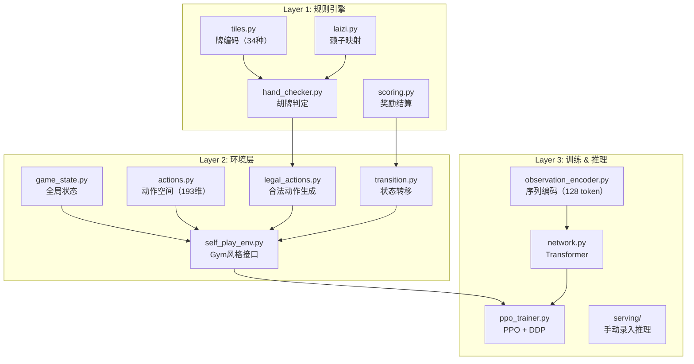
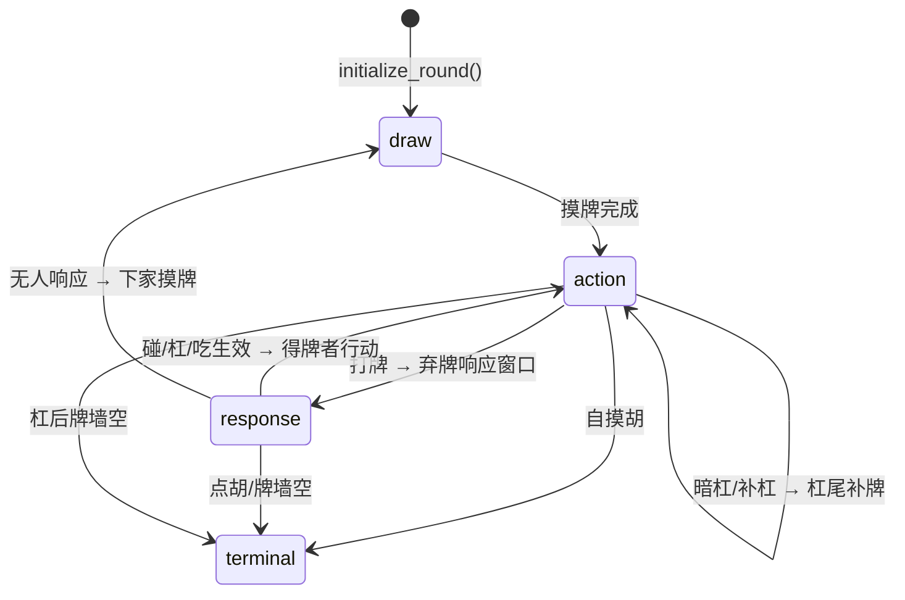
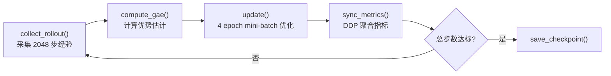

# 麻将 AI 代码结构深度分析

## 总体架构

项目采用 **三层解耦** 架构，共 5 个核心模块：



---

## 一、规则引擎层（`rules/`）

### 1.1 牌编码 — [tiles.py](file:///home/chf777/Documents/mahjong/mahjong_ai/rules/tiles.py)

使用 **34 种基础牌索引**，每种 4 张共 136 张：

| 编码范围 | 含义 | 示例 |
|---------|------|------|
| 0–8 | 万子 1m–9m | `0`=一万, `8`=九万 |
| 9–17 | 筒子 1p–9p | `9`=一筒, `17`=九筒 |
| 18–26 | 索子 1s–9s | `18`=一索, `26`=九索 |
| 27–30 | 风牌 E/S/W/N | 东南西北 |
| 31–33 | 箭牌 C/F/P | 中发白 |

核心工具函数：[make_counts()](file:///home/chf777/Documents/mahjong/mahjong_ai/rules/tiles.py#83-90) 将牌列表转为长度 34 的计数向量，是整个项目最基础的数据表示。

### 1.2 赖子规则 — [laizi.py](file:///home/chf777/Documents/mahjong/mahjong_ai/rules/laizi.py)

- [indicator_to_laizi(indicator)](file:///home/chf777/Documents/mahjong/mahjong_ai/rules/laizi.py#21-34): 序数牌取同花色下一点（9→1 循环）；字牌按 `东→南→西→北→中→发→白→东` 循环
- [pop_laizi_from_counts()](file:///home/chf777/Documents/mahjong/mahjong_ai/rules/laizi.py#36-43): 从计数向量中移除赖子，返回赖子数量

### 1.3 胡牌判定 — [hand_checker.py](file:///home/chf777/Documents/mahjong/mahjong_ai/rules/hand_checker.py)

统一入口 [check_win()](file:///home/chf777/Documents/mahjong/mahjong_ai/rules/hand_checker.py#36-60) 返回 [WinResult(is_win, win_type, detail)](file:///home/chf777/Documents/mahjong/mahjong_ai/rules/hand_checker.py#29-34)，按优先级检查：

1. **七对** — 7 对即可，赖子可凑对
2. **十三幺** — 13 种幺九字牌各 1 张 + 任一对，赖子补缺
3. **全不靠** — 14 张互不成靠，使用排列组合枚举 [(1,4,7)/(2,5,8)/(3,6,9)](file:///home/chf777/Documents/mahjong/mahjong_ai/rules/hand_checker.py#256-300) 三组跨花色
4. **组合龙** — 拆出 `147/258/369` 跨三门各一组（9 张），剩余 5 张需组成 1 面子 + 1 对将
5. **标准胡** — `4 面子 + 1 对将`，将牌限 2/5/8 序数牌

> [!IMPORTANT]
> 面子拆解使用 **DFS + `lru_cache` 记忆化搜索**：从最小有牌索引开始，尝试刻子或顺子两种拆法，赖子可补足缺牌。

### 1.4 奖励结算 — [scoring.py](file:///home/chf777/Documents/mahjong/mahjong_ai/rules/scoring.py)

| 事件 | 奖励 |
|-----|------|
| 点胡 | 胡牌者 +1 |
| 自摸 | 胡牌者 +2 |
| 明杠 | 即时 +1 |
| 暗杠 | 即时 +2 |
| 杠上开花 | 按暗杠+胡牌叠加 |
| 输家 | 每人 -1 |

杠牌奖励**即时发放**，胡牌与输家惩罚**终局结算**。

---

## 二、环境层（`env/`）

### 2.1 动作空间 — [actions.py](file:///home/chf777/Documents/mahjong/mahjong_ai/env/actions.py)

固定 **193 维** 动作空间，结构：

| 动作类型 | 数量 | ID 范围 |
|---------|------|---------|
| pass | 1 | 0 |
| hu | 1 | 1 |
| discard(tile) | 34 | 2–35 |
| peng(tile) | 34 | 36–69 |
| ming_gang(tile) | 34 | 70–103 |
| an_gang(tile) | 34 | 104–137 |
| bu_gang(tile) | 34 | 138–171 |
| chi(start) | 21 | 172–192 |

通过 [legal_action_mask](file:///home/chf777/Documents/mahjong/mahjong_ai/env/self_play_env.py#95-99) 保证模型只在合法动作中决策。

### 2.2 游戏状态 — [game_state.py](file:///home/chf777/Documents/mahjong/mahjong_ai/env/game_state.py)

[GameState](file:///home/chf777/Documents/mahjong/mahjong_ai/env/game_state.py#25-67) 维护完整对局状态：

- **牌墙**：双指针 `[wall_head, wall_tail]`，正常摸牌取 head，杠后补牌取 tail
- **手牌**：`hands[seat]` 为 34 维计数向量
- **阶段状态机**：`phase ∈ {draw, action, response, terminal}`
- **响应机制**：`response_stage ∈ {hu, peng_gang, chi}` + `response_order` 按座位顺序轮询

### 2.3 状态转移 — [transition.py](file:///home/chf777/Documents/mahjong/mahjong_ai/env/transition.py)



关键流程：
1. **[initialize_round()](file:///home/chf777/Documents/mahjong/mahjong_ai/env/transition.py#23-51)**：建136张牌墙 → 每人发13张 → 庄家补到14张 → 翻赖子指示牌 → 进入action阶段
2. **[apply_turn_action()](file:///home/chf777/Documents/mahjong/mahjong_ai/env/transition.py#78-161)**：处理打牌、自摸胡、暗杠、补杠
3. **[apply_resolved_reaction()](file:///home/chf777/Documents/mahjong/mahjong_ai/env/transition.py#163-277)**：处理点胡、碰、明杠、吃、无人响应

### 2.4 合法动作生成 — [legal_actions.py](file:///home/chf777/Documents/mahjong/mahjong_ai/env/legal_actions.py)

- **自回合** [legal_actions_for_turn()](file:///home/chf777/Documents/mahjong/mahjong_ai/env/legal_actions.py#13-51): 检查自摸胡、暗杠（含赖子凑杠）、补杠（仅碰后自摸同张）、打牌
- **弃牌响应** [legal_reactions_to_discard()](file:///home/chf777/Documents/mahjong/mahjong_ai/env/legal_actions.py#53-87): 检查点胡、碰、明杠、吃（仅下家）

响应裁决优先级（[resolve_reactions()](file:///home/chf777/Documents/mahjong/mahjong_ai/env/legal_actions.py#94-117)）：**胡 → 碰/杠 → 吃**，同级按座位顺序。

### 2.5 自博弈环境 — [self_play_env.py](file:///home/chf777/Documents/mahjong/mahjong_ai/env/self_play_env.py)

[SelfPlayEnv](file:///home/chf777/Documents/mahjong/mahjong_ai/env/self_play_env.py#32-222) 是 Gym 风格的核心接口：

```python
env = SelfPlayEnv(seed=42, dealer=0)
obs = env.reset()
while True:
    mask = env.legal_action_mask()  # 193维bool
    action = model_select(obs, mask)
    result = env.step(action)       # → StepResult(obs, reward, done, info)
    if result.done:
        break
```

> [!NOTE]
> 弃牌响应被拆成 **三阶段轮询**（hu → peng_gang → chi），每阶段按座位顺序逐一询问所有相关玩家，收集 claims 后统一裁决。这使得四个玩家的决策被序列化为一连串 step 调用。

---

## 三、Agent 模块（`agent/`）

### 3.1 观测编码 — [observation_encoder.py](file:///home/chf777/Documents/mahjong/mahjong_ai/agent/observation_encoder.py)

将 `observation` dict 编码为 **128 长度的 token 序列**：

| 区段 | Token数 | 内容 |
|-----|---------|------|
| 手牌 | 34 | 34种牌各1个token，value=计数 |
| 弃牌 | 34 | 全场弃牌聚合计数 |
| 副露 | 34 | 全场副露聚合计数 |
| 元信息 | 8 | seat, current_player, dealer, phase, wall_remaining, pending_discarder, laizi_tile, pending_tile |
| PAD | 18 | 补齐到128 |

每个 token 由三元组 [(token_type_id, tile_id, value_id)](file:///home/chf777/Documents/mahjong/mahjong_ai/rules/hand_checker.py#256-300) 表示，token_type 区分来源。

### 3.2 Transformer 网络 — [network.py](file:///home/chf777/Documents/mahjong/mahjong_ai/agent/network.py)

[TransformerPolicyValueNet](file:///home/chf777/Documents/mahjong/mahjong_ai/agent/network.py#28-111) 架构：

```
输入嵌入 = TokenType嵌入 + Tile嵌入 + Value嵌入 + Position嵌入
    ↓ LayerNorm + Dropout
    ↓ 16层 TransformerEncoder (pre-norm, GELU, d=256, heads=8, ffn=1024)
    ↓ LayerNorm
    ↓ Masked Mean Pooling（排除PAD）
   ╱ ╲
Policy Head    Value Head
(LN → Linear 193)  (LN → Linear 1)
```

> [!IMPORTANT]
> [apply_action_mask()](file:///home/chf777/Documents/mahjong/mahjong_ai/agent/network.py#106-111) 将非法动作的 logits 设为 `-1e9`，保证 softmax 后概率趋近于 0。这是整个系统保证不产生非法动作的关键机制。

### 3.3 推理与采样 — [inference.py](file:///home/chf777/Documents/mahjong/mahjong_ai/agent/inference.py)

- [masked_argmax()](file:///home/chf777/Documents/mahjong/mahjong_ai/agent/inference.py#11-25): 贪心推理（确定性）
- [sample_action_id()](file:///home/chf777/Documents/mahjong/mahjong_ai/agent/inference.py#38-43): 基于 `Categorical` 分布的随机采样（训练用）

---

## 四、PPO 训练算法（`training/`）

### 4.1 训练入口 — [train_transformer.py](file:///home/chf777/Documents/mahjong/train_transformer.py)

通过 `torchrun --nproc_per_node=4` 启动 4-GPU DDP 训练。命令行参数控制模型结构和训练超参。

### 4.2 PPO 训练器 — [ppo_trainer.py](file:///home/chf777/Documents/mahjong/mahjong_ai/training/ppo_trainer.py)

#### 训练循环



#### Rollout 采集（[collect_rollout()](file:///home/chf777/Documents/mahjong/mahjong_ai/training/ppo_trainer.py#161-240)）

```
for 2048 步:
    1. 编码当前 observation → token 序列
    2. 前向推理（no_grad）→ logits + value
    3. 应用 action mask → Categorical 分布采样
    4. env.step(action) → reward, done
    5. 存储 (obs, action, log_prob, value, reward, done)
    6. 若 done → env.reset(new_seed, rotate_dealer)
最后一步额外计算 bootstrap value
```

#### GAE 优势估计（[compute_gae()](file:///home/chf777/Documents/mahjong/mahjong_ai/training/ppo_trainer.py#313-330)）

$$\delta_t = r_t + \gamma \cdot V(s_{t+1}) \cdot (1-done_t) - V(s_t)$$
$$\hat{A}_t = \delta_t + \gamma \cdot \lambda \cdot (1-done_t) \cdot \hat{A}_{t+1}$$

参数：`γ=0.99`, `λ=0.95`

#### PPO 更新（[update()](file:///home/chf777/Documents/mahjong/mahjong_ai/training/ppo_trainer.py#241-312)）

每次 update 进行 **4 个 epoch**，每 epoch 将 2048 条数据随机打乱后按 mini-batch=512 切分：

```
对每个 mini-batch:
    1. 前向计算 → new_log_probs, entropy, value
    2. ratio = exp(new_log_prob - old_log_prob)
    3. policy_loss = -min(ratio·A, clip(ratio, 1±0.2)·A)
    4. value_loss = MSE(value, returns)
    5. loss = policy_loss + 0.5·value_loss - 0.01·entropy
    6. 梯度裁剪 (max_norm=1.0) → AdamW 更新
```

#### 关键超参数

| 参数 | 值 | 说明 |
|-----|-----|------|
| `clip_ratio` | 0.2 | PPO 策略裁剪范围 |
| `value_coef` | 0.5 | 价值损失权重 |
| `entropy_coef` | 0.01 | 熵正则化，鼓励探索 |
| `learning_rate` | 5e-4 | AdamW 学习率 |
| `max_grad_norm` | 1.0 | 梯度裁剪 |
| `gamma` | 0.99 | 折扣因子 |
| `gae_lambda` | 0.95 | GAE 平滑参数 |

#### DDP 多卡支持

- 每个 rank 拥有独立的 [SelfPlayEnv](file:///home/chf777/Documents/mahjong/mahjong_ai/env/self_play_env.py#32-222)，独立 seed（`seed + rank`）和 dealer 偏移
- 模型通过 `DistributedDataParallel` 自动同步梯度
- 训练指标通过 `all_reduce` 聚合（`done_count` 求和，其余取均值）
- 仅 rank 0 负责 checkpoint 保存和 wandb logging

### 4.3 自博弈机制

当前采用 **共享参数四人自博弈**：4 个座位使用同一模型，每局结束后轮换庄家（`dealer + 1`），并递增 seed 确保牌局多样性。

> [!NOTE]
> [development_plan.md](file:///home/chf777/Documents/mahjong/development_plan.md) 中规划了"历史版本池"机制（当前模型与旧模型混打）来稳定训练，但当前代码尚未实现。

### 4.4 监控指标

训练过程通过 wandb 记录：
- **Rollout**: `avg_reward`, `done_rate`, `avg_value_pred`, `avg_advantage`
- **Update**: `loss`, `policy_loss`, `value_loss`, `entropy`, `approx_kl`, `clip_fraction`, `explained_var`
- **Timing**: `rollout_sec`, `update_sec`, `steps_per_sec`

---

## 五、推理交互层（`serving/`）

面向实战的手动录入推理接口：

- [session.py](file:///home/chf777/Documents/mahjong/mahjong_ai/serving/session.py): [GameSession](file:///home/chf777/Documents/mahjong/mahjong_ai/serving/session.py#19-132) 管理对局状态，支持 [apply_event()](file:///home/chf777/Documents/mahjong/mahjong_ai/serving/session.py#54-112) 输入事件和 [undo_last_event()](file:///home/chf777/Documents/mahjong/mahjong_ai/serving/session.py#128-132) 撤销
- [event_parser.py](file:///home/chf777/Documents/mahjong/mahjong_ai/serving/event_parser.py): 标准化外部事件格式
- [recommend.py](file:///home/chf777/Documents/mahjong/mahjong_ai/serving/recommend.py): 基于启发式规则的动作推荐（优先级：胡 > 暗杠 > 明杠/补杠 > 碰 > 吃 > 弃牌评分）

---

## 六、文件依赖关系总览

```
train.sh
 └── train_transformer.py (入口)
      └── PPOTrainer
           ├── ObservationEncoder → TransformerPolicyValueNet
           ├── SelfPlayEnv
           │    ├── transition.py (状态转移)
           │    │    ├── hand_checker.py (胡牌判定)
           │    │    ├── laizi.py (赖子)
           │    │    ├── scoring.py (奖励)
           │    │    └── tiles.py (牌编码)
           │    ├── legal_actions.py (合法动作)
           │    └── actions.py (动作空间)
           └── Categorical + GAE + PPO Clip (训练算法)
```
